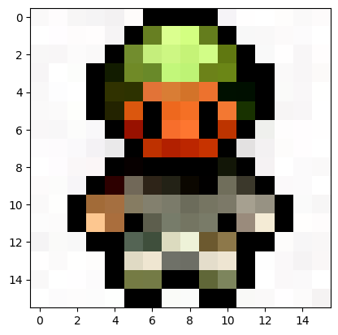
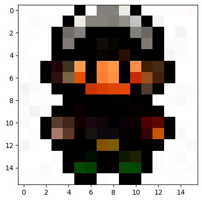
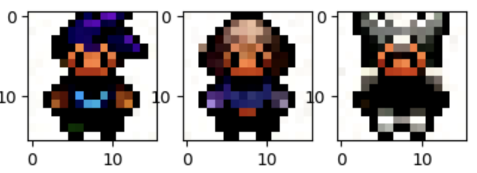
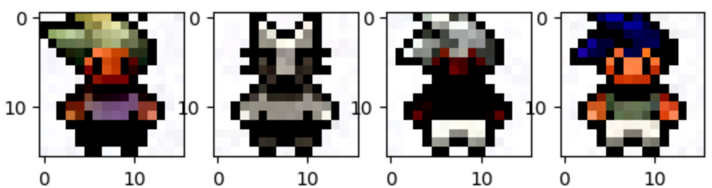
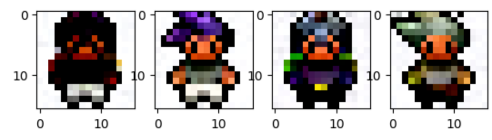
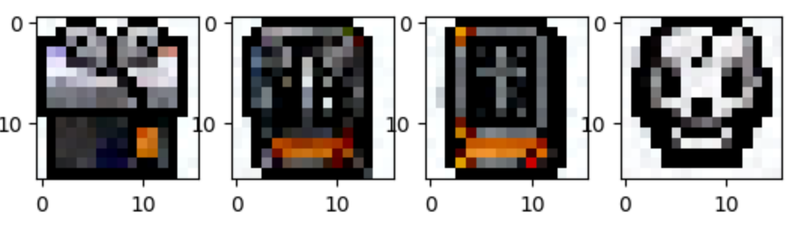

## Intro
This project is a pytorch reproduction of the DDPM algorithm, and the data set uses a custom data set.

## Basic Info
Database: from [DeepLearning.ai](https://learn.deeplearning.ai/diffusion-models/lesson/1/introduction)
Python: 3.9.6
Pytorch: 2.0.1

## Try

`Train: python src/train.py`
`Sample: python src/sample.py`

## Show Result

## Show Sample Process

